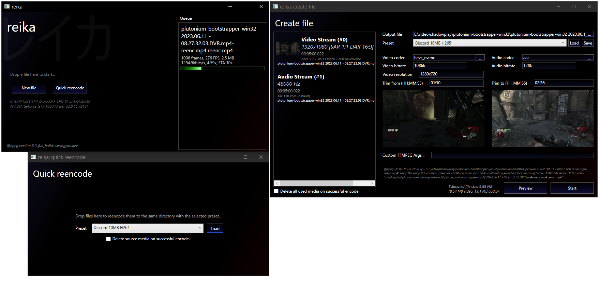

# reika
GUI for FFMPEG made in C# WPF

## Install
Either grab the latest release from https://github.com/counter185/reika/releases or the latest [Actions build](https://github.com/counter185/reika/actions)

## Build
To build the .sln you need the .NET Framework 4.8 SDK and Visual Studio 2022 or its build tools. Open the solution file and build it like any other C# project.

## Contribute
Bug reports, feature suggestions and pull requests are welcome.